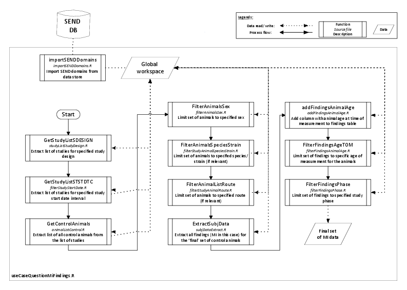

[](https://github.com/phuse-org/phuse-scripts/blob/master/LICENSE.md) 

# BioCelelerate Script Repository

The search scripts shared in this folder are intended to be used to query and collate information from 
SEND datasets which can then be utilized by the searcher for their own cross-study analysis.  Nothing 
in these scripts in intended to guide the analytic process and any interpretations of data found as a 
result of using these scripts are solely the responsibility of the user of the scripts and not the developers.

The scripts in this folder are subject to the MIT Open Source License:

MIT License

Copyright (c) 2019 PhUSEPermission is hereby granted, free of charge, to any person obtaining a copy
of this software and associated documentation files (the "Software"), to deal
in the Software without restriction, including without limitation the rights
to use, copy, modify, merge, publish, distribute, sublicense, and/or sell
copies of the Software, and to permit persons to whom the Software is
furnished to do so, subject to the following conditions:

The above copyright notice and this permission notice shall be included in
all copies or substantial portions of the Software.

THE SOFTWARE IS PROVIDED "AS IS", WITHOUT WARRANTY OF ANY KIND, EXPRESS OR
IMPLIED, INCLUDING BUT NOT LIMITED TO THE WARRANTIES OF MERCHANTABILITY,
FITNESS FOR A PARTICULAR PURPOSE AND NONINFRINGEMENT. IN NO EVENT SHALL THE
AUTHORS OR COPYRIGHT HOLDERS BE LIABLE FOR ANY CLAIM, DAMAGES OR OTHER
LIABILITY, WHETHER IN AN ACTION OF CONTRACT, TORT OR OTHERWISE, ARISING FROM,
OUT OF OR IN CONNECTION WITH THE SOFTWARE OR THE USE OR OTHER DEALINGS IN
THE SOFTWARE.


## Script Overview

The scripts in this package have been designed and are maintined by [BioCelerate](https://transceleratebiopharmainc.com/biocelerate/) group. 
If you're interested in contributing to the scripts, please contact:


## Getting started

### Dependencies 

The scripts in this repository reply on the following external packages that need to be installed into the R programming environment:

* data.table
* tidyverse
* RSQLite 

## Configuration

Prior to using these scripts scripts, a configuration file named `sysParameters.R` needs to be created in the home directory of the scripts. In 
this file three variables should be named declaring the path of the folder containing the SEND study datasets, the folder in this repository called `metadata/` 
and the location of the SQLite database. This file should look like so:

sysParameters.R
```
library(tools)

# 
studyRoot <- "/PATH/TO/SEND/DATASETS"
metadataRoot <- file.path(file_path_as_absolute("."), 'metadata')

# SEND data base name and location
dbFullName <- file.path("/PATH/TO/SQLite", "send.db")

```

Alternatively, this file can be created by running the config.R script from the command line like so:

```
RScript.R config.R
```

or normally as a script within R Studio.

You will be prompted to provide the location of the SEND dataset folder as well as where you would like to store the SQLite database.

The SEND dataset folder structure should look like this:
<pre>
/PATH/TO/SEND/DATASETS  
+-- STUDYID1  
   |   +-- ts.xpt  
   |   +-- dm.xpt  
   |   +-- ex.xpt  
   |   +-- etc.  
+-- STUDYID2   
   |   +-- ts.xpt  
   |   +-- dm.xpt  
   |   +-- ex.xpt  
   |   +-- etc.  
+-- STUDYID3  
   |   +-- ts.xpt  
   |   +-- dm.xpt  
   |   +-- ex.xpt  
   |   +-- etc.  
</pre>
However, the subdirectories within `/PATH/TO/SEND/DATASETS`  can be titled anything and not necessarily named by their STUDYID.

## Creating the SQLite database.

The scripts contained within this repository rely on the creation of a SQLite database storing multiple study and domain records. 
Provided in the repository are two scripts that will create this database for you. 

`poolAllStudyDomains.R` will populate the database and assumes that the studies provided within  `/PATH/TO/SEND/DATASETS` contain minimal 
errors.  

`poolAllStudyDomainsStrict.R` will populate the database, but is strict and restrictive to include studies in the SQLIte database unless they meet
 the following criteria: 

1) contains a TS domain
2) contains a DM domain
3) contains an EX domain
4) has readable .xpt files for all domains in the study
5) containes domain variables only allowed in SEND IG 3.0 and 3.1
6) has one unique STUDYID across all domains submitted.


## Script overview.

The following R modules each contain functions for querying and manipulating the SQLite SEND database. Further documentation and usage can be found within each module. 

An example use case can be found in the script `useCaseQuestionMiFindings.R` and the accompanying data flow is outlined the following schematic. 





## Script Directory 


| Script  | Description |
|---|---|
| importSENDDomains.R  |  General Module to pull domains from SQLite in R datatable |
| poolAllStudyDomains.R  |  Creates SQLite database |
| poolAllStudyDomainsStrict.R  |  Creates SQLite database  |
| addFindingsAnimalAge.R  |  add animal age to a list of findings  |
| animalListControl.R  | extract a set of control animals  |
| epoch_phase_detection.R | helper to detect phase of study from epoch  |
| extractTSParam.R  | general TS parameter and variable extractor |
| filterAnimalsSex.R  |  filter a list of animals by sex  |
| filterFindingsAnimalAge.R  | filter a list of animals by age  |
| filterFindingsPhase.R  | filter a list of findings by phase  |
| filterMIFindings.R  |   |
| filterStudyAnimalRoute.R  | Filter studyids by animal route  |
| filterStudyAnimalSpeciesStrain.R  | filter studyis by species and/or strain  |
| miscFunctions.R  | Misc. Functions  |
| studyListDoseDuration.R  |  filters study by dose duration |
| studyListSpeciesStrain.R  | filter study by species strain  |
| studyListStudyDesign.R  | filter study by study design  |
| studyListStudyStartDate.R  | filter studys by start date  |
| subjDataExtract.R  | extract animal subject data |
| useCaseQuestionMiFindings.R  |  Example use care script |


